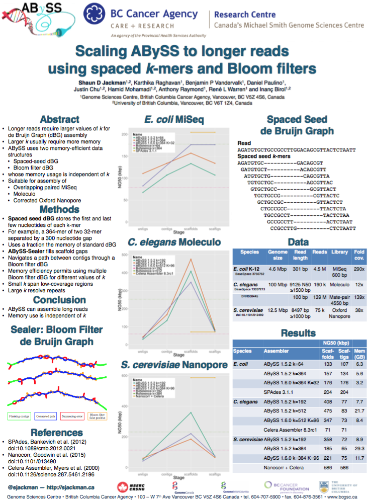
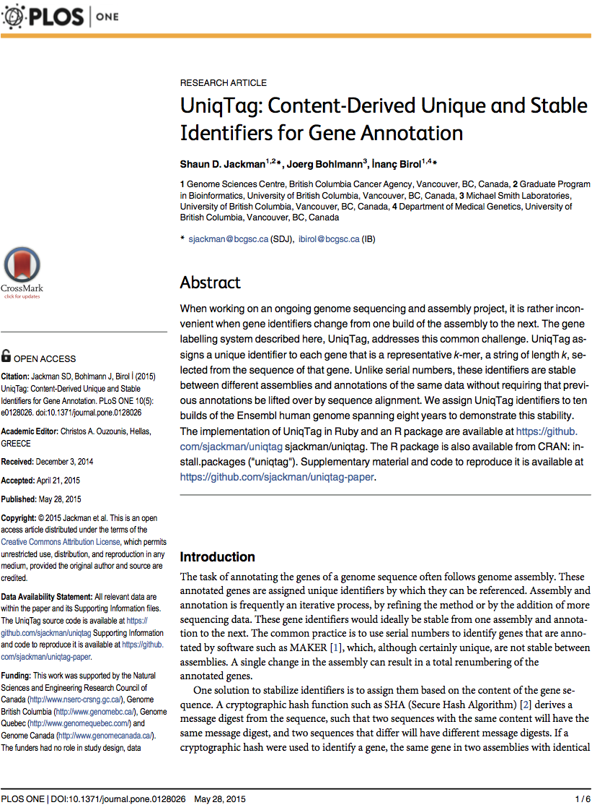
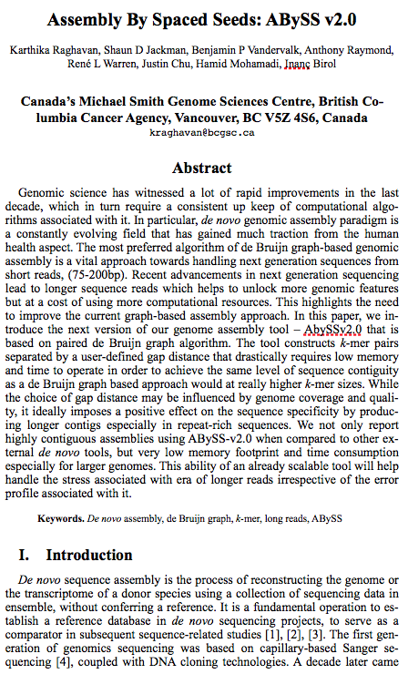
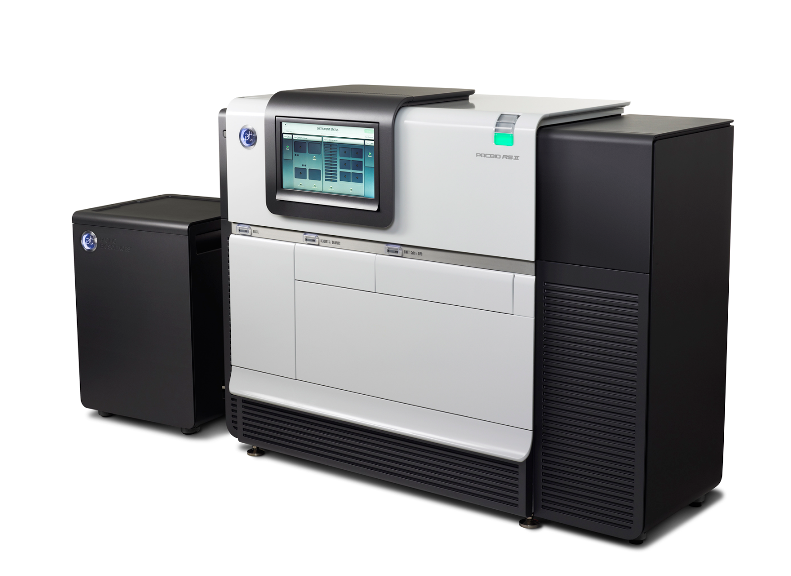
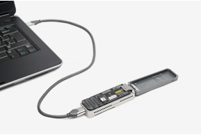
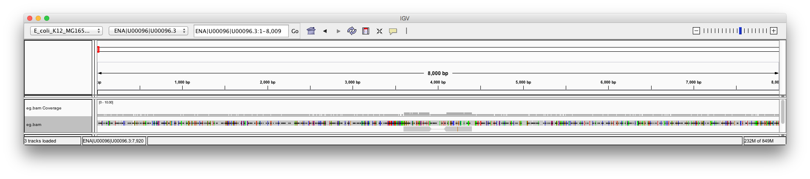
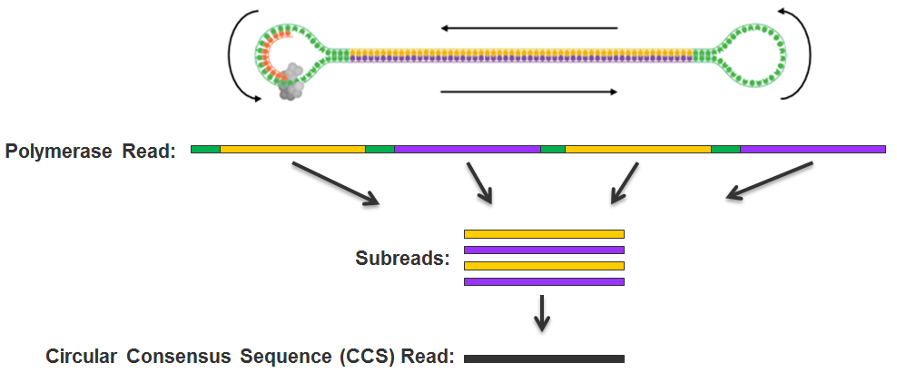
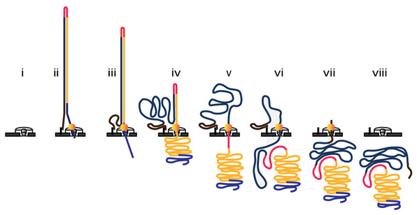
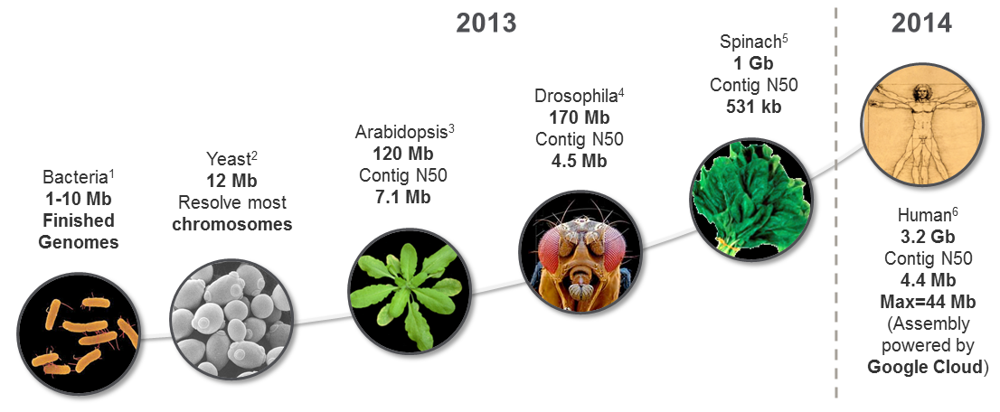

People
================================================================================

Shaun Jackman
------------------------------------------------------------

| [Genome Sciences Centre][], BC Cancer Agency
| Vancouver, Canada
| [\@sjackman][]
| [github.com/sjackman][]
| [sjackman.ca][]

[][sjackman.ca]

[\@sjackman]: https://twitter.com/sjackman
[Genome Sciences Centre]: http://bcgsc.ca
[github.com/sjackman]: https://github.com/sjackman
[sjackman.ca]: http://sjackman.ca

Thesis committee
------------------------------------------------------------

| [Inanc Birol][]
| [Joerg Bohlmann][]
| [Steven Hallam][]
| [Jenny Bryan][]

[Inanc Birol]: http://www.bcgsc.ca/faculty/inanc-birol
[Joerg Bohlmann]: http://bohlmannlab.msl.ubc.ca/
[Steven Hallam]: http://hallam.microbiology.ubc.ca/
[Jenny Bryan]: http://www.stat.ubc.ca/~jenny/

2014
================================================================================

Presentations and posters
------------------------------------------------------------

| [Plant and Animal Genome XXII][PAG 2014 workshop]
| <small>San Diego, California, USA &middot; 2014 January 10--15</small>
| [International HPC Summer School 2014][]
| <small>Budapest, Hungary &middot; 2014 June 1--6</small>
| [Conifer Genome Summit 2014][]
| <small>For&ecirc;t Montmorency, Qu&eacute;bec, Canada &middot; 2014 June 16--18</small>
| [HiTSeq and ISMB 2014][ISMB 2014 poster]
| <small>Boston, Massachusetts, USA &middot; 2014 July 11--15</small>

[PAG 2014 poster]: http://figshare.com/articles/Assembling_the_genomes_of_the_plastid_and_mitochondrion_of_white_spruce_Picea_glauca_/904941
[PAG 2014 workshop]: https://speakerdeck.com/sjackman/assembling-the-genome-sequences-of-the-plastid-and-mitochondrion-of-white-spruce
[International HPC Summer School 2014]: http://summerschool.niif.hu/
[Conifer Genome Summit 2014]: https://speakerdeck.com/sjackman/organellar-genomes-of-white-spruce-picea-glauca-assembly-and-annotation
[ISMB 2014 poster]: http://f1000.com/posters/browse/summary/1096524

Teaching assistant
------------------------------------------------------------

[STAT 540][] Statistical Methods for High Dimensional Biology

[BIOF 520][] Problem-Based Learning In Bioinformatics

[BIOF 520]: https://courses.students.ubc.ca/cs/main?dept=BIOF&course=520
[STAT 540]: http://www.ugrad.stat.ubc.ca/~stat540/

2015
================================================================================

rOpenSci Unconference
------------------------------------------------------------

| San Francisco, USA &middot; 2015 March 26--27

[][rOpenSci Unconf]

[rOpenSci Unconf]: http://unconf.ropensci.org/

RECOMB 2015
------------------------------------------------------------

| Research in Computational Molecular Biology
| Warsaw, Poland &middot; 2015 April 10--15

[][RECOMB 2015 poster]

[RECOMB 2015 poster]: http://f1000.com/posters/browse/summary/1097878

Teaching assistant
------------------------------------------------------------

[STAT 545][] Data wrangling, exploration, and analysis with R

| Designed and taught a module on
| automating data analysis pipelines

[BIOF 520][] Problem-Based Learning In Bioinformatics

Designed and taught a module on genomic epidemiology

[STAT 545]: http://stat545-ubc.github.io/

Publications
================================================================================

UniqTag
------------------------------------------------------------

[][UniqTag]

[UniqTag]: http://journals.plos.org/plosone/article?id=10.1371/journal.pone.0128026

Manuscripts
================================================================================

White Spruce Organelles
------------------------------------------------------------

Organellar Genomes of White Spruce (*Picea glauca*): Assembly and Annotation

[ ][White spruce organelles]

[White spruce organelles]: https://github.com/sjackman/white-spruce-organelle-paper

ABySS 2.0
------------------------------------------------------------

| Assembly by Spaced Seeds

[][ABySS 2.0]

[ABySS 2.0]: https://github.com/bcgsc/abyss-paired-dbg-paper

Distance Estimate
------------------------------------------------------------

Estimating the distance between two sequences using paired-end reads

[][DistanceEst]

[DistanceEst]: https://github.com/sjackman/distance-estimate-paper

Homebrew Science
------------------------------------------------------------

[Homebrew][] | [Linuxbrew][] | [Homebrew-science][]

[][open-science]:

Dependencies of bioinformatics tools in Homebrew

[Homebrew]: http://brew.sh
[Linuxbrew]: http://brew.sh/linuxbrew/
[Homebrew-science]: http://brew.sh/homebrew-science/
[open-science]: http://sjackman.github.io/open-science/#/homebrew-navigates-dependency-hell

Single molecule sequencing
================================================================================

PacBio RS II
------------------------------------------------------------

[][PacBio RS II]

[PacBio RS II]: http://www.pacificbiosciences.com/

Oxford Nanopore MinION
------------------------------------------------------------

[][Oxford Nanopore MinION]

[Oxford Nanopore MinION]: https://www.nanoporetech.com/

Sequencing technologies
------------------------------------------------------------

Technology      | Read length | Error rate
----------------|-------------|-----------
Sanger          | 800 bp      | 0.1--1%
454             | 700 bp      | ~1%
Illumina        | 2 x 300 bp  | ~0.1%
PacBio          | 8--40 kbp   | ~13%
Oxford Nanopore | 8--200 kbp  | ~15%

A visual comparison
------------------------------------------------------------

PacBio circular consensus
------------------------------------------------------------

[][CCS]

[CCS]: http://files.pacb.com/software/smrtanalysis/2.2.0/doc/smrtportal/help/!SSL!/Webhelp/Portal_PacBio_Glossary.htm

Nanopore 2D
------------------------------------------------------------

[][Nanopore2D]

[Nanopore2D]: http://www.nature.com/nmeth/journal/v12/n4/fig_tab/nmeth.3290_SF13.html

Retool for SMS
================================================================================

Retool for SMS
------------------------------------------------------------

### Alignment

| Seed and extend is difficult when
| one in seven bases is incorrect

### Assembly

| de Bruijn graphs also require accurate seeds
| Return to overlap, layout, consensus (OLC)

SMS Assembly
================================================================================

Assembly Stages
------------------------------------------------------------

+ Overlap
+ Read correction
+ Layout
+ Consensus

Tools
------------------------------------------------------------

### Overlap

[BLASR][] &middot; [DALIGNER][] &middot; [MHAP][]

### Correction

[PBDAGCon][] &middot; [Falcon][] &middot; [Dazzler][] &middot; [Nanocorrect][]

### Layout

[Celera Assembler][] &middot; [Falcon][] &middot; [Dazzler][]

### Consensus

[Quiver][] &middot; [Nanopolish][]

[BLASR]: https://github.com/PacificBiosciences/blasr
[BWA-MEM]: https://github.com/lh3/bwa
[Celera Assembler]: http://wgs-assembler.sourceforge.net/
[DALIGNER]: https://github.com/thegenemyers/DALIGNER
[Dazzler]: https://dazzlerblog.wordpress.com/
[Falcon]: https://github.com/PacificBiosciences/falcon
[HGAP]: https://github.com/PacificBiosciences/Bioinformatics-Training/wiki/HGAP-in-SMRT-Analysis
[LAST]: http://last.cbrc.jp/
[MHAP]: https://github.com/marbl/MHAP
[Nanocorr]: http://schatzlab.cshl.edu/data/nanocorr/
[Nanocorrect]: https://github.com/jts/nanocorrect
[Nanopolish]: https://github.com/jts/nanopolish
[PBcR]: http://www.cbcb.umd.edu/software/PBcR/
[PBDAGCon]: https://github.com/PacificBiosciences/pbdagcon
[POA]: https://sourceforge.net/projects/poamsa/
[Quiver]: https://github.com/PacificBiosciences/GenomicConsensus

Pipelines
------------------------------------------------------------

Assembler      | Overlap  | Correct  | Layout  | Consensus
---------------|----------|----------|---------|----------
[HGAP][]       | BLASR    | PBDAGCon | CA      | Quiver
[Falcon][]     | DALIGNER | Falcon   | Falcon  | Quiver
[PBcR][]       | MHAP     | Falcon   | CA      | Quiver
[Dazzler][]    | DALIGNER | Dazzler  | Dazzler | Quiver
[Nanocorr][]   | BLAST    | PBDAGCon | CA      | CA
[Nanopolish][] | DALIGNER | POA      | CA      | Nanopolish

<small>CA: Celera Assembler</small>

Assembling large genomes
------------------------------------------------------------

[][PacBio-LargeGenomes]

[PacBio-LargeGenomes]: https://github.com/PacificBiosciences/Bioinformatics-Training/wiki/Large-Genome-Assembly-with-PacBio-Long-Reads

Assembling small genomes in 2015
------------------------------------------------------------

### Nanopore + Illumina

[Nanocorr][] *Saccharomyces cerevisiae* (12 Mbp)

### Nanopore only

[Nanopolish][] *Escherichia coli* (5 Mbp)

Thesis proposal
================================================================================

Organellar Genomes
------------------------------------------------------------

of White Spruce (*Picea glauca*): Assembly and Annotation

[ ][White spruce organelles]

Scaling ABySS
------------------------------------------------------------

### For the assembly of long reads

+ 500 bp overlapping paired-end reads (MiSeq)
+ 10 kbp synthetic long reads (Moleculo)
+ 8--200 kbp corrected single-molecule sequencing

&nbsp;

### Using memory efficient data structures

+ spaced seed de Bruijn Graph
+ Bloom filter de Bruijn Graph

Scaffolding
------------------------------------------------------------

Link contigs into scaffold using data from...

+ Illumina mate-pair sequencing
+ Illumina Moleculo
+ Single-molecule sequencing
+ Molecular barcoding (10X Genomics GemCode)

Assemble SMS
------------------------------------------------------------

### *Drosophila melanogaster*

+ Assembly with [PBcR][] used 621,000 CPU-hours, or 26 days with 1000 cores
+ [MHAP][] reduced assembly time to 700 CPU-hours
+ Efficient algorithms make a big difference!

. . .

### *Homo sapiens*

+ Assembly of [CHM1][] with [HGAP][] used 405,000 CPU-hours in one day on Google Cloud!
+ More work to be done for PacBio
+ And lots more work to be done for Nanopore

Progress
================================================================================

Organellar genomes
------------------------------------------------------------

### Completed

+ Assembled and annotated cpDNA and mtDNA genomes
+ Analysis of genes (mRNA, rRNA, tRNA, ORF) and repeats

Organellar genomes
------------------------------------------------------------

### Results

[ ][White spruce organelles]

Organellar genomes
------------------------------------------------------------

### Plan

+ Analyse RNA-seq
    + Annotate introns using Trans-ABySS assembly
    + Report C -> U RNA editing
+ Submit genomes to GenBank
+ Write manuscript with Rene and Ewan

ABySS 2.0
------------------------------------------------------------

### Completed

+ Implemented Bloom filter de Bruijn Graph
	+ Konnector with Ben
	+ Sealer with Daniel
+ Implemented spaced seeds de Bruijn Graph
+ Reduced memory and time requirements for long reads
+ Beats ABySS 1.5 and approaches [SPAdes][] for *E. coli*

[SPAdes]: http://bioinf.spbau.ru/spades

ABySS 2.0
------------------------------------------------------------

### Results

[][RECOMB 2015 poster]

ABySS 2.0
------------------------------------------------------------

### Plan

+ Optimize de Bruijn graph parameters (*k* and *&Delta;*) \
  to match or beat [SPAdes][] assembly of *E. coli*
+ Assemble larger genomes with ABySS 2.0
+ Compare to ABySS 1.5 and other assemblers
+ Iterate and improve ABySS 2.0
+ Write manuscript

Scaffolding
------------------------------------------------------------

Scaffold using data from...

### Completed

+ Illumina mate-pair sequencing
+ Illumina Moleculo

### Plan

+ Single-molecule sequencing
+ Molecular barcoding \
  (10X Genomics GemCode) \
  for white spruce (*Picea glauca*)

Assemble SMS
------------------------------------------------------------

### Completed

+ Overlap using spaced seed clustering \
  with Hamid and Justin
+ Layout
    + Numerical solution (ABySS-DrawGraph)
    + Graph pattern matching (ABySS-Layout)
+ Consensus using [BWA-MEM][] and samtools
+ Assemble a small 100 kbp synthetic genome

Assemble SMS
------------------------------------------------------------

### Plan

+ Layout
	+ Handle incorrect edges due to repeats
+ Consensus
    + Sealer with Ben
	+ LockStep with Justin
    + Compare to [Quiver][] and [Nanopolish][]
+ Assemble a small genome, *Escherichia coli*
	+ Compare to [Nanocorr][] and [Nanopolish][]
+ Scale up to larger genomes
    + Nanopore: *Saccharomyces cerevisiae*
    + PacBio: *Homo sapiens* hydatidiform mole [CHM1][]

[CHM1]: http://blog.pacificbiosciences.com/2014/02/data-release-54x-long-read-coverage-for.html

Summary
================================================================================

Summary
------------------------------------------------------------

1. Organellar Genomes of White Spruce (*Picea glauca*): Assembly and Annotation
2. Scale ABySS to assemble long, accurate reads
3. Scaffold using multiple types of data
4. Assemble single-molecule sequencing data

fin
================================================================================

Links
------------------------------------------------------------

| [Inanc Birol][] | [Joerg Bohlmann][]
| [Steven Hallam][] | [Jenny Bryan][]
| [RECOMB 2015 poster][] | [rOpenSci Unconf][]
| [UniqTag][]
| [White spruce organelles][] | [ABySS 2.0][] | [DistanceEst][]
| [BIOF 520][] | [STAT 545][]
| [Homebrew][] | [Linuxbrew][] | [Homebrew-science][]

Software
------------------------------------------------------------

| [BLASR][] | [BWA-MEM][] | [Celera Assembler][]
| [DALIGNER][] | [Dazzler][] | [Falcon][] | [HGAP][]
| [LAST][] | [MHAP][] | [Nanocorr][] | [Nanocorrect][]
| [Nanopolish][] | [PBcR][] | [PBDAGCon][] | [POA][]
| [Quiver][]

Links 2014
------------------------------------------------------------

| [PAG 2014 poster][] | [PAG 2014 workshop][]
| [Conifer Genome Summit 2014][] | [ISMB 2014 poster][]
| [International HPC Summer School 2014][]
| [BIOF 520][] | [STAT 540][]
| [Open, reproducible science][open-science]

Shaun Jackman
------------------------------------------------------------

| [Genome Sciences Centre][], BC Cancer Agency
| Vancouver, Canada
| [\@sjackman][]
| [github.com/sjackman][]
| [sjackman.ca][]

[][sjackman.ca]

More slides
================================================================================

Align
------------------------------------------------------------

+ [BLASR][] PacBio
+ [BWA-MEM][] (Burrows-Wheeler Aligner) Heng Li
+ [LAST][] Computational Biology Research Consortium, Tokyo, Japan

Overlap
------------------------------------------------------------

+ [BLASR][] PacBio
+ [DALIGNER][] Gene Myers
+ [MHAP][] (MinHash Alignment Process) Adam Phillippy

Read correction
------------------------------------------------------------

+ [PBDAGCon][] (PacBio DAG Consensus) PacBio
+ [Falcon][] PacBio
+ [Dazzler][] (Dresden Azzembler) Gene Myers
+ [Nanocorrect][] Jared Simpson (using [POA][])

Layout
------------------------------------------------------------

+ [Celera Assembler][] J. Craig Venter Institute (JCVI)
+ [Falcon][] PacBio
+ [Dazzler][] (Dresden Azzembler) Gene Myers

Consensus
------------------------------------------------------------

+ [Quiver][] PacBio
+ [Nanopolish][] Jared Simpson

Assembly Pipeline
------------------------------------------------------------

+ [HGAP][] (Hierarchical Genome Assembly Process) PacBio
+ [Falcon][] PacBio
+ [PBcR][] (PacBio Corrected Reads) Celera Assembler, JCVI
+ [Dazzler][] (Dresden Azzembler) Gene Myers
+ [Nanocorr][] Mike Schatz
+ [Nanopolish][] Jared Simpson
