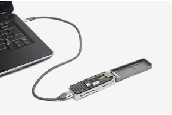
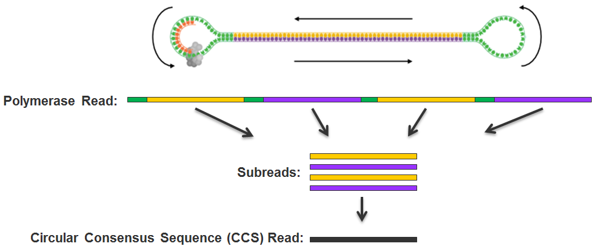
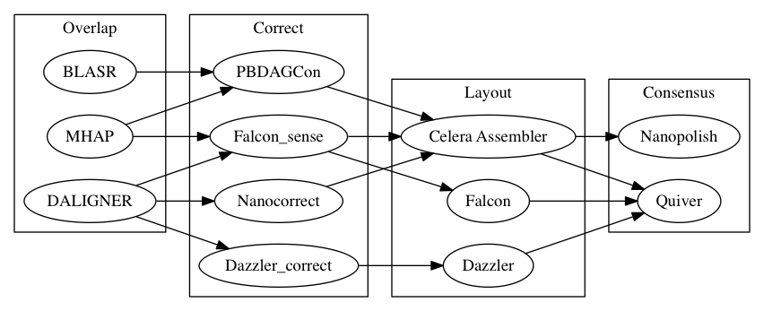

People
================================================================================

Shaun Jackman
------------------------------------------------------------

| [Genome Sciences Centre][], BC Cancer Agency
| Vancouver, Canada
| [\@sjackman][]
| [github.com/sjackman][]
| [sjackman.ca][]

[][sjackman.ca]

[\@sjackman]: https://twitter.com/sjackman
[Genome Sciences Centre]: http://bcgsc.ca
[github.com/sjackman]: https://github.com/sjackman
[sjackman.ca]: http://sjackman.ca

Thesis committee
------------------------------------------------------------

| [Inanc Birol][]
| [Joerg Bohlmann][]
| [Jenny Bryan][]
| [Steven Hallam][]

&nbsp;

### Chair

[Steven Jones][]

[Inanc Birol]: http://www.bcgsc.ca/faculty/inanc-birol
[Joerg Bohlmann]: http://bohlmannlab.msl.ubc.ca/
[Jenny Bryan]: http://www.stat.ubc.ca/~jenny/
[Steven Hallam]: http://hallam.microbiology.ubc.ca/
[Steven Jones]: http://www.bcgsc.ca/faculty/sjones

Activities in 2015
================================================================================

------------------------------------------------------------

### Conferences

| [rOpenSci Unconference][]
| [RECOMB 2015][]

### Teaching assistant

| [STAT 545][] Data wrangling, exploration, and analysis with R
| Automating data analysis pipelines

| [BIOF 520][] Problem-Based Learning In Bioinformatics
| Genomic epidemiology

[rOpenSci Unconference]: http://unconf.ropensci.org/
[RECOMB 2015]: http://f1000.com/posters/browse/summary/1097878
[BIOF 520]: https://courses.students.ubc.ca/cs/main?dept=BIOF&course=520
[STAT 545]: http://stat545-ubc.github.io/

------------------------------------------------------------

+ [UniqTag][]: Content-derived unique and stable identifiers for gene annotation \
	<small>
	**SD Jackman**, J Bohlmann, I Birol \
	PLOS ONE 2015
	</small>
+ Sealer: a scalable gap-closing application for finishing draft genomes \
	<small>
	D Paulino, RL Warren, BP Vandervalk, A Raymond, **SD Jackman**, I Birol \
	BMC Bioinformatics 2015
	</small>
+ Improved white spruce (*Picea glauca*) genome assemblies and annotation of large gene families of conifer terpenoid and phenolic defense metabolism \
	<small>
	RL Warren, CI Keeling, MMS Yuen, A Raymond, GA Taylor, ... \
	The Plant Journal 2015
	</small>
+ Spaced Seed Data Structures for De Novo Assembly \
	<small>
	I Birol, J Chu, H Mohamadi, **SD Jackman**, K Raghavan, BP Vandervalk, ... \
	International Journal of Genomics 2015
	</small>
+ DIDA: Distributed Indexing Dispatched Alignment \
	<small>
	H Mohamadi, BP Vandervalk, A Raymond, **SD Jackman**, J Chu, ... \
	PLOS ONE 2015
	</small>
+ On the Representation of De Bruijn Graphs \
	<small>
	R Chikhi, A Limasset, **SD Jackman**, JT Simpson, P Medvedev \
	Journal of Computational Biology 2015
	</small>
+ BioBloom tools: fast, accurate and memory-efficient host species sequence screening using bloom filters \
	<small>
	J Chu, S Sadeghi, A Raymond, **SD Jackman**, KM Nip, R Mar, ... \
	Bioinformatics 2014
	</small>
+ Konnector: Connecting paired-end reads using a bloom filter de Bruijn graph \
	<small>
	BP Vandervalk, **SD Jackman**, A Raymond, H Mohamadi, C Yang, D Attali, ... \
	Bioinformatics and Biomedicine (BIBM) 2014
	</small>

[UniqTag]: http://journals.plos.org/plosone/article?id=10.1371/journal.pone.0128026

Manuscripts
================================================================================

White Spruce Organelles
------------------------------------------------------------

Organellar Genomes of White Spruce (*Picea glauca*): Assembly and Annotation

[ ][White spruce organelles]

[White spruce organelles]: https://github.com/sjackman/white-spruce-organelle-paper

ABySS
------------------------------------------------------------

### Assembly by Spaced Seeds
for the assembly of long reads

[][ABySS 2.0]

[ABySS 2.0]: https://github.com/bcgsc/abyss-paired-dbg-paper

DistanceEst
------------------------------------------------------------

Estimating the distance between two contigs

[][DistanceEst]

[DistanceEst]: https://github.com/sjackman/distance-estimate-paper

Homebrew Science
------------------------------------------------------------

[Homebrew][] | [Linuxbrew][] | [Homebrew-science][]

[][Homebrew-science]

[][open-science]

[Homebrew]: http://brew.sh
[Linuxbrew]: http://brew.sh/linuxbrew/
[Homebrew-science]: http://brew.sh/homebrew-science/
[open-science]: http://sjackman.github.io/open-science/#/homebrew-navigates-dependency-hell

Thesis proposal
================================================================================

Thesis proposal
------------------------------------------------------------

1. Organellar Genomes of White Spruce (*Picea glauca*): Assembly and Annotation
2. Scale ABySS to assemble long, accurate reads
3. Scaffold using SMS and molecular barcoding
4. Assemble single-molecule sequencing data

Organellar Genomes of White Spruce: Assembly and Annotation
================================================================================

Organellar genomes
------------------------------------------------------------

### Completed

+ Assembled cpDNA and mtDNA genomes
+ Annotated genes (mRNA, rRNA, tRNA) and repeats
+ Analysed RNA-seq data to quantify
	+ transcript abundance in eight tissues
    + expressed ORFs
    + C-to-U RNA editing

Organellar genomes
------------------------------------------------------------

### Plan

+ Analyse RNA-seq data to annotate
	+ cryptic ACG start codons \
	  due to C-to-U RNA editing
	+ spliced ORFs
+ Submit annotated genomes to GenBank
+ Complete manuscript

Scale ABySS to assemble long, accurate reads
================================================================================

Scaling ABySS
------------------------------------------------------------

### For the assembly of long reads

+ 500 bp overlapping paired-end reads (MiSeq)
+ 10 kbp synthetic long reads (Moleculo)
+ 8--200 kbp corrected single-molecule sequencing

&nbsp;

### Using memory efficient data structures

+ spaced seed de Bruijn Graph
+ Bloom filter de Bruijn Graph

Scaling ABySS
------------------------------------------------------------

### Completed

+ Implemented Bloom filter de Bruijn Graph
	+ [Konnector] with Ben
	+ [Sealer] with Daniel
+ Implemented spaced seed de Bruijn Graph with Karthika
+ Reduced memory and time requirements for long reads
+ Memory usage is independent of parameter *k*

### Plan

+ Assemble model organisms, human in particular, with ABySS 2.0
+ Compare to ABySS 1.5 and other dBG assemblers

[Konnector]: http://dx.doi.org/10.1109/BIBM.2014.6999126
[Sealer]: http://www.biomedcentral.com/1471-2105/16/230

RECOMB 2015
------------------------------------------------------------

| Research in Computational Molecular Biology
| Warsaw, Poland &middot; 2015 April 10--15

[][RECOMB 2015]

Scaffold using SMS and molecular barcoding
================================================================================

Scaffolding
------------------------------------------------------------

Order and orient contigs to build scaffolds using...

&nbsp;

### Completed

+ Illumina mate-pair libraries
+ Illumina Moleculo with Tony

&nbsp;

### Plan

+ Single-molecule sequencing
+ Molecular barcoding \
  10X Genomics GemCode \
  for white spruce (*Picea glauca*)

Assemble single-molecule sequencing data
================================================================================

Assemble SMS
------------------------------------------------------------

### *Drosophila melanogaster*

+ Assembly with [PBcR][] used 621,000 CPU-hours, \
  or 26 days with 1000 cores
+ [MHAP][] reduced assembly time to 700 CPU-hours
+ Efficient algorithms make a big difference!

&nbsp;

### *Homo sapiens*

+ Assembly of [CHM1][] with [HGAP][] used 405,000 CPU-hours \
  in one day on Google Cloud!
+ More work to be done for PacBio
+ And lots more work to be done for Nanopore

Assemble SMS
------------------------------------------------------------

### Overlap

+ Spaced seed clustering with Hamid and Justin

### Layout

+ Numerical solution with ABySS-DrawGraph

### Consensus

+ BWA-MEM and samtools
+ Assembled a small 100 kbp synthetic genome

### Plan

+ Continue development with Hamid, Justin and Ben
+ Assemble Nanopore *Escherichia coli* (5 Mbp)
	+ Nanopore *Saccharomyces cerevisiae* (12 Mbp)
	+ PacBio *Homo sapiens* [CHM1][] (3 Gbp)

[CHM1]: http://blog.pacificbiosciences.com/2014/02/data-release-54x-long-read-coverage-for.html

Thesis proposal
================================================================================

Thesis proposal
------------------------------------------------------------

1. Organellar Genomes of White Spruce (*Picea glauca*): Assembly and Annotation
2. Scale ABySS to assemble long, accurate reads
3. Scaffold using SMS and molecular barcoding
4. Assemble single-molecule sequencing data

fin
================================================================================

Shaun Jackman
------------------------------------------------------------

| [Genome Sciences Centre][], BC Cancer Agency
| Vancouver, Canada
| [\@sjackman][]
| [github.com/sjackman][]
| [sjackman.ca][]

[][sjackman.ca]

Links
------------------------------------------------------------

| [Inanc Birol][] | [Joerg Bohlmann][]
| [Steven Hallam][] | [Jenny Bryan][]
| [RECOMB 2015][] | [rOpenSci Unconference][]
| [UniqTag][]
| [White spruce organelles][] | [ABySS 2.0][] | [DistanceEst][]
| [BIOF 520][] | [STAT 545][]
| [Open, reproducible science][open-science]
| [Homebrew][] | [Linuxbrew][] | [Homebrew-science][]

Software
------------------------------------------------------------

| [BLASR][] | [BWA-MEM][] | [Celera Assembler][]
| [DALIGNER][] | [Dazzler][] | [Falcon][] | [HGAP][]
| [LAST][] | [MHAP][] | [Nanocorr][] | [Nanocorrect][]
| [Nanopolish][] | [PBcR][] | [PBDAGCon][] | [POA][]
| [Quiver][]

More slides
================================================================================

Single molecule sequencing
================================================================================

PacBio RS II
------------------------------------------------------------

[][PacBio RS II]

[PacBio RS II]: http://www.pacificbiosciences.com/

Oxford Nanopore MinION
------------------------------------------------------------

[][Oxford Nanopore MinION]

[Oxford Nanopore MinION]: https://www.nanoporetech.com/

Sequencing technologies
------------------------------------------------------------

Technology      | Read length | Error rate
----------------|-------------|-----------
Sanger          | 800 bp      | 0.1--1%
454             | 700 bp      | ~1%
Illumina        | 2 x 300 bp  | ~0.1%
PacBio          | 8--40 kbp   | ~13%
Oxford Nanopore | 8--200 kbp  | ~15%

A visual comparison
------------------------------------------------------------

PacBio circular consensus
------------------------------------------------------------

[][CCS]

[CCS]: http://files.pacb.com/software/smrtanalysis/2.2.0/doc/smrtportal/help/!SSL!/Webhelp/Portal_PacBio_Glossary.htm

Nanopore 2D
------------------------------------------------------------

[][Nanopore2D]

[Nanopore2D]: http://www.nature.com/nmeth/journal/v12/n4/fig_tab/nmeth.3290_SF13.html

Assembly of Single-molecule Sequencing
================================================================================

Assembly Stages
------------------------------------------------------------

### Overlap
Find all significantly overlapping reads

### Correct
Recall the consensus base of each read

### Layout
Determine the order and orientation of the reads

### Consensus
Call the consensus base of each contig

Tools
------------------------------------------------------------

### Overlap

[BLASR][] &middot; [DALIGNER][] &middot; [MHAP][]

### Correct

[PBDAGCon][] &middot; [Falcon][] &middot; [Dazzler][] &middot; [Nanocorrect][]

### Layout

[Celera Assembler][] &middot; [Falcon][] &middot; [Dazzler][]

### Consensus

[Quiver][] &middot; [Nanopolish][]

[BLASR]: https://github.com/PacificBiosciences/blasr
[BWA-MEM]: https://github.com/lh3/bwa
[Celera Assembler]: http://wgs-assembler.sourceforge.net/
[DALIGNER]: https://github.com/thegenemyers/DALIGNER
[Dazzler]: https://dazzlerblog.wordpress.com/
[Falcon]: https://github.com/PacificBiosciences/falcon
[HGAP]: https://github.com/PacificBiosciences/Bioinformatics-Training/wiki/HGAP-in-SMRT-Analysis
[LAST]: http://last.cbrc.jp/
[MHAP]: https://github.com/marbl/MHAP
[Nanocorr]: http://schatzlab.cshl.edu/data/nanocorr/
[Nanocorrect]: https://github.com/jts/nanocorrect
[Nanopolish]: https://github.com/jts/nanopolish
[PBcR]: http://www.cbcb.umd.edu/software/PBcR/
[PBDAGCon]: https://github.com/PacificBiosciences/pbdagcon
[POA]: https://sourceforge.net/projects/poamsa/
[Quiver]: https://github.com/PacificBiosciences/GenomicConsensus

Pipelines
------------------------------------------------------------

Assembler      | Overlap  | Correct     | Layout  | Consensus
---------------|----------|-------------|---------|----------
[HGAP][]       | BLASR    | PBDAGCon    | Celera  | Quiver
[Falcon][]     | DALIGNER | Falcon      | Falcon  | Quiver
[PBcR][]       | MHAP     | Falcon      | Celera  | Quiver
[Dazzler][]    | DALIGNER | Dazzler     | Dazzler | Quiver
[Nanocorr][]   | BLAST    | PBDAGCon    | Celera  | Celera
[Nanopolish][] | DALIGNER | Nanocorrect | Celera  | Nanopolish

[][sms-olc]

[sms-olc]: https://github.com/sjackman/thesis-committee/blob/gh-pages/images/sms-olc.gv

Assembling large genomes
------------------------------------------------------------

[][PacBio-LargeGenomes]

[PacBio-LargeGenomes]: https://github.com/PacificBiosciences/Bioinformatics-Training/wiki/Large-Genome-Assembly-with-PacBio-Long-Reads

Assembling small genomes in 2015
------------------------------------------------------------

### Nanopore + Illumina

[Nanocorr][] *Saccharomyces cerevisiae* (12 Mbp)

### Nanopore only

[Nanopolish][] *Escherichia coli* (5 Mbp)

Retool for SMS
================================================================================

Retool for SMS
------------------------------------------------------------

### Alignment

| Seed and extend is difficult when
| one in seven bases is incorrect

### Assembly

| de Bruijn graphs also require accurate seeds
| Return to overlap, layout, consensus (OLC)

Align
------------------------------------------------------------

+ [BLASR][] PacBio
+ [BWA-MEM][] (Burrows-Wheeler Aligner) Heng Li
+ [LAST][] Computational Biology Research Consortium, Tokyo, Japan

Overlap
------------------------------------------------------------

+ [BLASR][] PacBio
+ [DALIGNER][] Gene Myers
+ [MHAP][] (MinHash Alignment Process) Adam Phillippy

Read correction
------------------------------------------------------------

+ [PBDAGCon][] (PacBio DAG Consensus) PacBio
+ [Falcon][] PacBio
+ [Dazzler][] (Dresden Azzembler) Gene Myers
+ [Nanocorrect][] Jared Simpson (using [POA][])

Layout
------------------------------------------------------------

+ [Celera Assembler][] J. Craig Venter Institute (JCVI)
+ [Falcon][] PacBio
+ [Dazzler][] (Dresden Azzembler) Gene Myers

Consensus
------------------------------------------------------------

+ [Quiver][] PacBio
+ [Nanopolish][] Jared Simpson

Assembly Pipeline
------------------------------------------------------------

+ [HGAP][] (Hierarchical Genome Assembly Process) PacBio
+ [Falcon][] PacBio
+ [PBcR][] (PacBio Corrected Reads) Celera Assembler, JCVI
+ [Dazzler][] (Dresden Azzembler) Gene Myers
+ [Nanocorr][] Mike Schatz
+ [Nanopolish][] Jared Simpson
