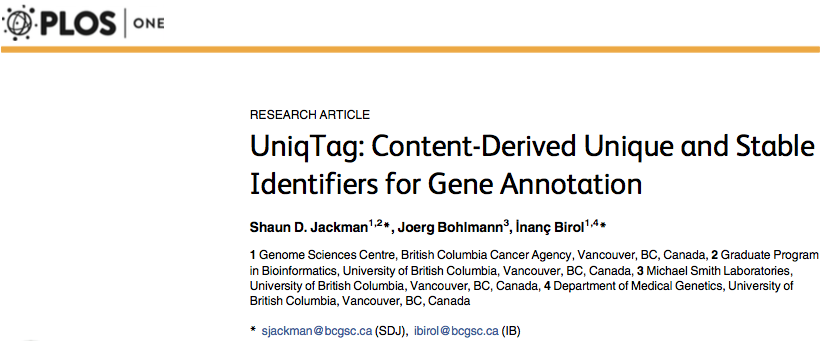

Shaun Jackman
------------------------------------------------------------

| [Genome Sciences Centre][], BC Cancer, Vancouver, Canada
| [\@sjackman][] · [github.com/sjackman][] · [sjackman.ca][]

[][sjackman.ca]

[\@sjackman]: https://twitter.com/sjackman
[Genome Sciences Centre]: http://bcgsc.ca
[github.com/sjackman]: https://github.com/sjackman
[sjackman.ca]: http://sjackman.ca

Thesis Committee
------------------------------------------------------------

| [Inanc Birol][]
| [Joerg Bohlmann][]
| [Steven Hallam][]
| [Steven Jones][]

[Inanc Birol]: http://www.bcgsc.ca/faculty/inanc-birol
[Joerg Bohlmann]: http://bohlmannlab.msl.ubc.ca/
[Steven Hallam]: http://hallam.microbiology.ubc.ca/
[Steven Jones]: http://www.bcgsc.ca/faculty/sjones

Timeline
------------------------------------------------------------

- Previous meeting 2015-07-27
- Fourth committee meeting 2018-03-14
- Start writing early 2018
- Submit thesis and defend late 2018
- Graduate spring 2019

Conferences
------------------------------------------------------------

- Three talks and four posters
- [ISMB 2016 BOSC talk](http://sjackman.ca/linuxbrew-slides)
  and [poster](https://f1000research.com/posters/5-1795) \
  <small>Linuxbrew and Homebrew for Cross-platform Package Management</small>
- [ISMB 2016 HiTSeq poster](https://f1000research.com/posters/5-2072) \
  <small>Organellar Genomes of White spruce (*Picea glauca*): Assembly and annotation</small>
- [PAG 2017 talk](http://sjackman.ca/picea-sitchensis-organelles-slides/)
  and [AGBT 2017 poster](https://f1000research.com/posters/6-132) \
  <small>Organellar Genomes of Sitka Spruce (*Picea sitchensis*): Assembly and Annotation</small>
- [ISMB 2017 talk](http://sjackman.ca/tigmint-slides/)
  and [poster](https://f1000research.com/posters/6-1406) \
  <small>Tigmint: Correct Misassemblies Using Linked Reads From Large Molecules</small>

Teaching Assistant
------------------------------------------------------------

UBC Master of Data Science

- 2016 [DSCI 522][] Data Science Workflows
- 2017 [DSCI 531][] Data Visualization I

[DSCI 522]: https://ubc-mds.github.io/course-descriptions/DSCI_522_dsci-workflows/
[DSCI 531]: https://ubc-mds.github.io/course-descriptions/DSCI_531_viz-1/

------------------------------------------------------------

| 2017 Genome Research
| [{height=150px}][ABySS2]
| 2016 Genome Biology and Evolution
| [{height=150px}][WhiteSpruceOrganelles]
| 2015 PLOS ONE
| [{height=150px}][UniqTag]

[ABySS2]: https://doi.org/10.1101/gr.214346.116
[WhiteSpruceOrganelles]: https://doi.org/10.1093/gbe/evv244
[UniqTag]: https://doi.org/10.1371/journal.pone.0128026

<aside class="notes">

- ABySS 2.0: resource-efficient assembly of large genomes using a Bloom filter \
    <small>
    **SD Jackman**^\*^, BP Vandervalk^\*^, H Mohamadi, J Chu, S Yeo, SA Hammond, ... \
    Genome Research 2017
    </small>
- Organellar genomes of white spruce (*Picea glauca*): assembly and annotation \
    <small>
    **SD Jackman**, RL Warren, EA Gibb, BP Vandervalk, H Mohamadi, J Chu, ... \
    Genome Biology and Evolution 2015
    </small>
- UniqTag: Content-derived unique and stable identifiers for gene annotation \
	<small>
	**SD Jackman**, J Bohlmann, I Birol \
	PLOS ONE 2015
	</small>

</aside>

Papers
------------------------------------------------------------

- Assembly of the complete Sitka spruce chloroplast genome using 10X Genomics’ GemCode sequencing data
    <small>
    L Coombe, RL Warren, **SD Jackman**, C Yang, BP Vandervalk, RA Moore, ... \
    PloS one 2016
    </small>
- Spaced seed data structures for de novo assembly \
    <small>
    I Birol, J Chu, H Mohamadi, **SD Jackman**, K Raghavan, BP Vandervalk, ... \
    International journal of genomics 2015
    </small>
- Konnector v2.0: pseudo-long reads from paired-end sequencing data \
    <small>
	BP Vandervalk, C Yang, Z Xue, K Raghavan, J Chu, H Mohamadi, **SD Jackman**,... \
	BMC medical genomics 2015
	</small>
- Sealer: a scalable gap-closing application... \
	<small>
	D Paulino, RL Warren, BP Vandervalk, A Raymond, **SD Jackman**, I Birol \
	BMC Bioinformatics 2015
	</small>
- Improved white spruce (*Picea glauca*) genome... \
	<small>
	RL Warren, CI Keeling, MMS Yuen, A Raymond, GA Taylor, ... \
	The Plant Journal 2015
	</small>

Papers
------------------------------------------------------------

- Three first-author (or joint) papers since 2015
- Collaborated on 29 papers since 2009
- 25 papers with at least 10 citations
- Two first-author manuscripts in preparation

Manuscripts
------------------------------------------------------------

- ORCA: A Comprehensive Bioinformatics Container Environment for Education and Research
    <small>
    **SD Jackman**^\*^, T Mozgacheva^\*^, B O'Huiginn, L Bailey, I Birol, SJM Jones
    </small>
- Tigmint: Correct Assembly Errors Using Linked Reads From Large Molecules
    <small>
    **SD Jackman**, J Chu, RL Warren, BP Vandervalk, L Coombe, S Yeo, ...
    </small>

[{height=250px}][Tigmint]

[Tigmint]: http://github.com/bcgsc/tigmint

Thesis Outline
------------------------------------------------------------

### Methods

1. ABySS 2.0: resource-efficient assembly of large genomes
2. Tigmint: Correcting misassemblies using linked reads
3. UniqTag: Content-derived unique and stable identifiers

### Genomes

1. Organellar genomes of white spruce (*Picea glauca*) \
   using paired-end and mate-pair reads
2. Organellar genomes of Sitka spruce (*Picea sitchensis*) \
   using linked reads and Nanopore reads
3. Genome assembly of western redcedar (*Thuja plicata*) \
   using paired-end, mate-pair, and linked reads

White Spruce Organelles
------------------------------------------------------------

- Assembled cpDNA and mtDNA genomes
- Annotated genes (mRNA, rRNA, tRNA) and repeats
- Analysed RNA-seq data to quantify
	- transcript abundance in eight tissues
    - expressed ORFs
    - C-to-U RNA editing
	- cryptic ACG start codons due to C-to-U RNA editing
- Submitted annotated genomes to GenBank
- Published paper in Genome Biology and Evolution (2015)

------------------------------------------------------------

{height=600px}

Sitka Spruce Plastid
------------------------------------------------------------

- Assembled by Rene Warren and Lauren Coombe \
  using linked reads
- Annotated genes (mRNA, rRNA, tRNA)
- Submitted annotated genomes to GenBank
- Published paper in PLOS ONE (2016)

------------------------------------------------------------

| {height=600px}

Sitka Spruce Mitochondrion
------------------------------------------------------------

+ 10x Genomics Chromium sequencing
- &gt; 50x mitochondrial coverage in one lane
- 11 lanes of Oxford Nanopore Sequencing
- 3x nuclear coverage
- 14x mitochondrial coverage
- Assemble Nanopore reads \
  with Canu and Unicycler
- Scaffold and polish with linked reads

------------------------------------------------------------

Sitka Spruce Mitochondrion
------------------------------------------------------------

- Complete the genome assembly
- Determine chromosomal structure
- Annotate the genome
- Submit the genome to GenBank
- Write the manuscript

ABySS 2.0
------------------------------------------------------------

- Implemented Bloom filter de Bruijn Graph
	- [Konnector] and [Konnector 2.0] with Ben Vandervalk
	- [Sealer] with Daniel Paulino
    - [ABySS 2.0] with Ben Vandervalk
- Reduce memory usage by twelve fold over ABySS 1.0
- Assemble a conifer genome with a single machine
- Memory usage is independent of parameter *k*
- Assembled a human genome with ABySS 2.0 (35 GB RAM)

[Konnector]: http://doi.org/10.1109/BIBM.2014.6999126
[Konnector 2.0]: https://doi.org/10.1186/1755-8794-8-S3-S1
[Sealer]: http://www.biomedcentral.com/1471-2105/16/230

ABySS 2.0
------------------------------------------------------------

- Compared to ABySS 1.5 and six other assemblers
- Submitted genome assemblies to NCBI
- Published paper in Genome Research (2017)
- Presenting a talk at RECOMB-Seq 2018

| 

Tigmint
------------------------------------------------------------

Correcting misassemblies using linked reads

- Incorrectly assembled sequence complicates all downstream analyses
- Misassemblies also limit contiguity
- Cut contigs where linked reads and assembly disagree
- Tigmint + ARCS improved contiguity two fold over ARCS alone in human
  from 8 Mbp to 16 Mbp scaffold NGA50
- Further developed the tool with Lauren Coombe
- Presenting a talk and poster at RECOMB-Seq 2018

[{height=100px}][Tigmint]

------------------------------------------------------------

| 

------------------------------------------------------------

| {height=600px}

Western Redcedar (*Thuja plicata*)
------------------------------------------------------------

### Method

- Trim adapters with Trimadap and NxTrim
- Count k-mers with ntCard
- Estimate genome size GenomeScope
- Assemble PE and MP reads with ABySS 2.0
- Scaffold with Chromium reads using ARCS
- Assess genome completeness using BUSCO

### Results

- Scaffold NG50 of 1.2 Mbp
- BUSCO 54% complete, 7% fragmented

Thesis Outline
------------------------------------------------------------

### Methods

1. ABySS 2.0: resource-efficient assembly of large genomes
2. Tigmint: Correcting misassemblies using linked reads
3. UniqTag: Content-derived unique and stable identifiers

### Genomes

1. Organellar genomes of white spruce (*Picea glauca*) \
   using paired-end and mate-pair reads
2. Organellar genomes of Sitka spruce (*Picea sitchensis*) \
   using linked reads and Nanopore reads
3. Genome assembly of western redcedar (*Thuja plicata*) \
   using paired-end, mate-pair, and linked reads

fin
================================================================================

Shaun Jackman
------------------------------------------------------------

| [Genome Sciences Centre][], BC Cancer, Vancouver, Canada
| [\@sjackman][] &middot; [github.com/sjackman][] &middot; [sjackman.ca][]

[][sjackman.ca]
