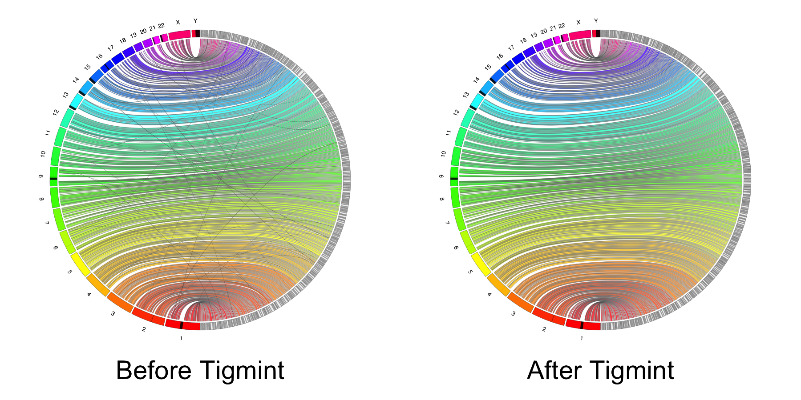

Shaun Jackman
------------------------------------------------------------

| [Genome Sciences Centre][], BC Cancer, Vancouver, Canada
| [\@sjackman][] &middot; [github.com/sjackman][] &middot; [sjackman.ca][]

[][sjackman.ca]

[\@sjackman]: https://twitter.com/sjackman
[Genome Sciences Centre]: http://bcgsc.ca
[github.com/sjackman]: https://github.com/sjackman
[sjackman.ca]: http://sjackman.ca

Thesis Committee
------------------------------------------------------------

| [Inanc Birol][], Medical Genetics
| [Joerg Bohlmann][], Michael Smith Laboratories
| [Steven Hallam][], Microbiology & Immunology
| [Steven Jones][], Medical Genetics

### University Examiners

| [Paul Pavlidis][], Michael Smith Laboratories
| [Keith Adams][], Botany

Previous committee meeting 2018-03-14

[Inanc Birol]: http://www.bcgsc.ca/faculty/inanc-birol
[Joerg Bohlmann]: http://bohlmannlab.msl.ubc.ca/
[Steven Hallam]: http://hallam.microbiology.ubc.ca/
[Steven Jones]: http://www.bcgsc.ca/faculty/sjones
[Paul Pavlidis]: https://www.msl.ubc.ca/people/dr-paul-pavlidis/
[Keith Adams]: https://botany.ubc.ca/people/keith-adams

------------------------------------------------------------

| 2018 Tigmint. *BMC Bioinformatics*
| [{height=100px}](https://doi.org/10.1186/s12859-018-2425-6)
| 2017 ABySS 2.0. *Genome Research*
| [{height=100px}](https://doi.org/10.1101/gr.214346.116)
| 2016 White Spruce Organelles. *Genome Biology and Evolution*
| [{height=100px}](https://doi.org/10.1093/gbe/evv244)
| 2015 UniqTag. *PLOS ONE*
| [{height=100px}](https://doi.org/10.1371/journal.pone.0128026)

<aside class="notes">

- Tigmint: correcting assembly errors using linked reads from large molecules \
    <small>
	**SD Jackman**, L Coombe, J Chu, RL Warren, BP Vandervalk, ... \
	*BMC Bioinformatics* 2018
    </small>
- ABySS 2.0: resource-efficient assembly of large genomes using a Bloom filter \
    <small>
    **SD Jackman**^\*^, BP Vandervalk^\*^, H Mohamadi, J Chu, S Yeo, SA Hammond, ... \
    *Genome Research* 2017
    </small>
- Organellar genomes of white spruce (*Picea glauca*): assembly and annotation \
    <small>
    **SD Jackman**, RL Warren, EA Gibb, BP Vandervalk, H Mohamadi, J Chu, ... \
    *Genome Biology and Evolution* 2015
    </small>
- UniqTag: content-derived unique and stable identifiers for gene annotation \
	<small>
	**SD Jackman**, J Bohlmann, I Birol \
	*PLOS ONE* 2015
	</small>

</aside>

Selected Papers
------------------------------------------------------------

- Assembly of the complete Sitka spruce chloroplast...
    <small>
    L Coombe, RL Warren, **SD Jackman**, C Yang, BP Vandervalk, ..., I Birol \
    *PloS one* 2016
    </small>
- Spaced seed data structures for de novo assembly \
    <small>
    I Birol, J Chu, H Mohamadi, **SD Jackman**, K Raghavan, ..., RL Warren \
    *International journal of genomics* 2015
    </small>
- Konnector v2.0: pseudo-long reads from PE sequencing \
    <small>
	BP Vandervalk, C Yang, Z Xue, K Raghavan, J Chu, H Mohamadi, **SD Jackman**, ..., I Birol \
	*BMC medical genomics* 2015
	</small>
- Sealer: a scalable gap-closing application... \
	<small>
	D Paulino, RL Warren, BP Vandervalk, A Raymond, **SD Jackman**, I Birol \
	*BMC Bioinformatics* 2015
	</small>
- On the representation of de Bruijn graphs \
	<small>
	R Chikhi, A Limasset, **SD Jackman**, JT Simpson, P Medvedev \
	*Journal of Computational Biology* 2015
	</small>
- Improved white spruce (*Picea glauca*) genome... \
	<small>
	RL Warren, CI Keeling, MMS Yuen, A Raymond, GA Taylor, ..., J Bohlmann \
	*The Plant Journal* 2015
	</small>
- Assembling the 20Gb white spruce genome... \
	<small>
	I Birol, A Raymond, **SD Jackman**, S Pleasance, R Coope, ..., SJM Jones \
	*Bioinformatics* 2013
	</small>

Papers
------------------------------------------------------------

- Four first-author (or joint) papers
- One paper each year from 2015 through 2018
- Collaborated on 32 papers since 2009
- 28 papers with at least 10 citations
- One first-author manuscript in review (ORCA)
- One first-author manuscript in preparation \
  (Sitka spruce mitochondrion)
- ABySS has been cited over 2,700 times!

Manuscripts
------------------------------------------------------------

- ORCA: A Comprehensive Bioinformatics Container Environment for Education and Research
    <small>
    **SD Jackman**^\*^, T Mozgacheva^\*^, S Chen, B O'Huiginn, L Bailey, I Birol, SJM Jones \
	(in review)
    </small>
- Largest Complete Mitochondrial Genome of a Gymnosperm, Sitka Spruce (*Picea sitchensis*), Indicates Complex Physical Structure
    <small>
	**SD Jackman**, L Coombe, RL Warren, ..., J Bohlmann, SJM Jones, Inanc Birol
	</small>

Efficient Assembly of Large Genomes
------------------------------------------------------------

1. Introduction
2. ABySS 2.0
3. Tigmint
4. UniqTag
5. ORCA
6. Organellar genomes of white spruce
7. Mitochondrial genome of Sitka spruce
8. Genome assembly of western redcedar
9. Conclusion

ABySS 2.0
------------------------------------------------------------

- Implemented Bloom filter de Bruijn Graph
	- [Konnector] and [Konnector 2.0] with Ben Vandervalk
	- [Sealer] with Daniel Paulino
    - [ABySS 2.0] with Ben Vandervalk
- Reduce memory usage by twelve fold over ABySS 1.0
- Assemble a conifer genome with a single machine
- Memory usage is independent of parameter *k*
- Assembled a human genome with ABySS 2.0 (35 GB RAM)

[Konnector]: http://doi.org/10.1109/BIBM.2014.6999126
[Konnector 2.0]: https://doi.org/10.1186/1755-8794-8-S3-S1
[Sealer]: http://www.biomedcentral.com/1471-2105/16/230

ABySS 2.0
------------------------------------------------------------

- Compared to ABySS 1.5 and six other assemblers
- Submitted genome assemblies to NCBI
- Published paper in *Genome Research* (2017)
- Presented a talk at RECOMB-Seq 2018

| 

------------------------------------------------------------

[{height=150}](https://github.com/bcgsc/tigmint)

Correcting misassemblies using linked reads

- Incorrectly assembled sequence complicates all downstream analyses
- Misassemblies also limit contiguity
- Cut contigs where linked reads and assembly disagree
- Tigmint + ARCS improved contiguity two fold over ARCS alone in human
  from 8 Mbp to 16 Mbp scaffold NGA50
- Further developed the tool with Lauren Coombe
- Presented a talk and poster at RECOMB-Seq 2018

------------------------------------------------------------

| 

------------------------------------------------------------

| {height=600px}

UniqTag
------------------------------------------------------------

Assign unique and stable gene identifiers \
to genes based on their sequence content

### Background

- Genes without function identified by serial number
- One small changes causes a complete renumbering
- Inconvenient when gene identifiers change \
  between assembly versions

### UniqTag

- Genes with unchanged coding sequence have \
  stable identifiers between assembly versions
- Published paper in *PLOS ONE* (2015)

ORCA
------------------------------------------------------------

- Comprehensive bioinformatics computing environment
- Includes hundreds of bioinformatics tools \
  in a single easily-installed Docker image \
  (all tools available to the Homebrew package manager)
- Useful for education and research

### Use Cases

- External collaborators of BC Cancer
- Hackseq genomics hackathon (<https://hackseq.com>)
- Undergraduate class on bioinformatics at UBC

White Spruce Organelles
------------------------------------------------------------

- Assembled cpDNA and mtDNA genomes
- Annotated genes (mRNA, rRNA, tRNA) and repeats
- Analysed RNA-seq data to quantify
	- transcript abundance in eight tissues
    - expressed ORFs
    - C-to-U RNA editing
	- cryptic ACG start codons due to C-to-U RNA editing
- Submitted annotated genomes to GenBank
- Published paper in Genome Biology and Evolution (2015)

------------------------------------------------------------

{height=600px}

Sitka Spruce Mitochondrion Methods
------------------------------------------------------------

- 11 lanes of Oxford Nanopore Sequencing
- 5x nuclear coverage
- 26x mitochondrial coverage
- 10x Genomics Chromium sequencing
- 59x mitochondrial coverage in one lane
- Assemble Nanopore reads
- Polish with linked reads
- Annotate genes

------------------------------------------------------------

Sitka Spruce Mitochondrion Results
------------------------------------------------------------

- Largest complete mitochondrial genome \
  of a gymnosperm (5.5 Mbp)
- Multipartite genome structure
- Rosette-like assembly graph
- 26 introns in 13 genes
- 13 trans-spliced introns in 7 genes

Western Redcedar Methods
------------------------------------------------------------

- Trim adapters with Trimadap and NxTrim
- Count k-mers with ntCard
- Estimate genome size GenomeScope
- Assemble PE and MP reads with ABySS 2.0
- Correct assembly errors \
  with Chromium reads using Tigmint
- Scaffold with Chromium reads using ARCS
- Assess genome completeness using BUSCO

Western Redcedar Results
------------------------------------------------------------

- 12.5 Gbp genome size estimated by flow cytometry \
  (Hizume *et al.* 2001 <https://doi.org/d89svf>)
- 9.8 Gbp genome size estimated by GenomeScope
- 7.95 Gbp assembled in scaffolds 1 kbp or larger
- 2.31 Mbp scaffold N50
- 1.71 Mbp scaffold NG50 (with *G*=10 Gbp)
- Tigmint improved NG50 by 14% over ARCS alone
- BUSCO 60.4% of core single-copy genes present \
  53.9% complete, 6.5% fragmented, 39.6% missing

Efficient Assembly of Large Genomes
------------------------------------------------------------

1. Introduction
2. ABySS 2.0
3. Tigmint
4. UniqTag
5. ORCA
6. Organellar genomes of white spruce
7. Mitochondrial genome of Sitka spruce
8. Genome assembly of western redcedar
9. Conclusion

fin
================================================================================

Shaun Jackman
------------------------------------------------------------

| [Genome Sciences Centre][], BC Cancer, Vancouver, Canada
| [\@sjackman][] &middot; [github.com/sjackman][] &middot; [sjackman.ca][]

[][sjackman.ca]
