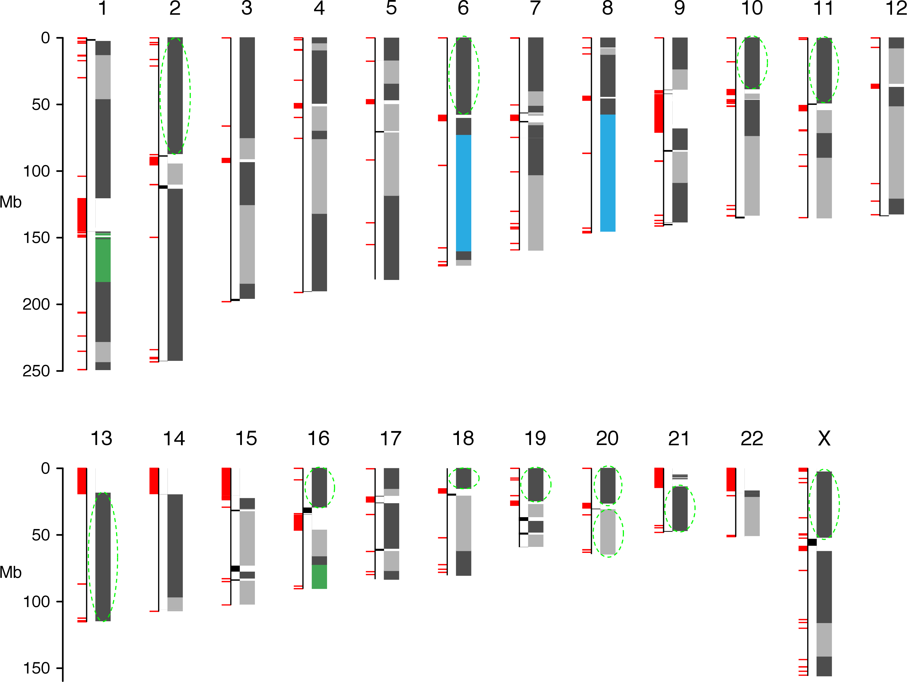

## Shaun Jackman

| [Genome Sciences Centre][], BC Cancer, Vancouver, Canada
| [\@sjackman][] &middot; [github.com/sjackman][] &middot; [sjackman.ca][]

[][sjackman.ca]

[\@sjackman]: https://twitter.com/sjackman
[Genome Sciences Centre]: http://bcgsc.ca
[github.com/sjackman]: https://github.com/sjackman
[sjackman.ca]: http://sjackman.ca

------------------------------------------------------------

| 2018 Tigmint. *BMC Bioinformatics*
| [{height=100px}](https://doi.org/10.1186/s12859-018-2425-6)
| 2017 ABySS 2.0. *Genome Research*
| [{height=100px}](https://doi.org/10.1101/gr.214346.116)
| 2016 White Spruce Organelles. *Genome Biology and Evolution*
| [{height=100px}](https://doi.org/10.1093/gbe/evv244)
| 2015 UniqTag. *PLOS ONE*
| [{height=100px}](https://doi.org/10.1371/journal.pone.0128026)

## Efficient Assembly of Large Genomes

1. Introduction
2. **ABySS 2.0**
3. **Tigmint**
4. UniqTag
5. ORCA
6. Organellar genomes of white spruce
7. Mitochondrial genome of Sitka spruce
8. **Genome assembly of western redcedar**
9. Conclusion

## Short Read Genome Assembly

| ABySS 1.0 (2009) was the first to assemble
| a human genome from short reads (42 bp!)

## ABySS 1.0

- de Bruijn graph assembler
- Stored *k*-mers in a hash table
- Distributed the hash table over many machines
- Used MPI to aggregate sufficient memory
- Assembles large genomes

## ABySS 1.0

|             | Human    | Spruce
|-------------|----------|----------
| Genome size | 3 Gbp    | 20 Gbp
| RAM         | 418 GB   | 4.3 TB
| CPU cores   | 64       | 1,380
| Wall time   | 14 hours | 12 days
| Year        | 2017     | 2013
| Short DOI   | [doi:f9x8qp](https://doi.org/f9x8qp) | [doi:f4zzrr](https://doi.org/f4zzrr)

## Challenges

- High memory usage
- Interprocess communication is slow
- Intermachine communication is really slow

## Solution

- | A memory-efficient data structure
  | reduces memory usage
- | Fitting entire graph in a single machine
  | eliminates intermachine communication
- | OpenMP rather than MPI
  | eliminates interprocess communication

## ABySS 2.0

| ABySS 2.0 (2017) reduces the memory
| usage of ABySS by ten fold.

----------------------------------------

{height=550px}

----------------------------------------

----------------------------------------

----------------------------------------

----------------------------------------

{height=550px}

## Spruce genome assemblies

| ABySS              | 1.3.5    | 2.0.0
|--------------------|----------|----------
| Spruce species     | Interior | Sitka
| Machines           | 115      | 1
| RAM (GB)           | 4,300    | 500
| CPU cores          | 1,380    | 64
| CPU time\* (years) | 6.0      | 3.2
| Wall time\* (days) | 1.6      | 18
| Year               | 2013     | 2017
| Short DOI          | [doi:f4zzrr](https://doi.org/f4zzrr) | NA

<small>\* Time of unitig assembly without scaffolding</small>

----------------------------------------

{height=600px}

----------------------------------------

{height=600px}

## ABySS 2.0 Conclusions

- | ABySS 2.0 reduces memory usage by 10 fold
  | from 418 GB for ABySS 1.0
  | to 34 GB for ABySS 2.0
  | for a human genome assembly
- | High-throughput short-read sequencing
  | combined with large molecule scaffolding
  | such as 10X Genomics, BioNano, Hi-C
  | permits cost effective assembly of large genomes

------------------------------------------------------------

## Linked Reads

| 

## Tools for Linked Reads

| **Align linked reads**
| Lariat (Long Ranger) &middot; EMA
| **Structural variants**
| Long Ranger &middot; GROC-SVs &middot; NAIBR &middot; SVenX &middot; Topsorter
| **Phase variants**
| Long Ranger
| **Genome sequence assembly**
| Supernova
| **Scaffolding**
| ARCS &middot; Architect &middot; Fragscaff &middot; Scaff10x

<https://github.com/johandahlberg/awesome-10x-genomics>

## Contigs and scaffolds come to an end due to...

- repeats
- sequencing gaps
- structural variation
- misassemblies

## Misassemblies limit contiguity

particularly for highly contiguous assemblies.

Most scaffolding tools do not correct misassemblies.

----------------------------------------

| 

----------------------------------------

| 
| Correct misassemblies
| 

----------------------------------------

| 
| Correct misassemblies
| 
| Scaffold
| 

----------------------------------------

## Method

::: incremental

- Map reads to the assembly
- Group reads within *d* bp of each other (*d* = 50 kbp)
- Infer start and end coordinates of molecules
- Construct an interval tree of the molecules
- Each *w* bp region ought to be spanned by *n* molecules \
  (*w* = 1 kbp, *n* = 20)
- Identify regions with fewer than *n* spanning molecules
- Cut sequences at regions with insufficient coverage

:::

----------------------------------------

| Tracks from top to bottom
| molecule coverage, molecules, read coverage, reads

----------------------------------------

----------------------------------------

| {height=400px}

- Assemble human HG004 with PE, MP, and linked reads
- Scaffolding with ARCS improved NGA50 from 3 to 8 Mbp
- Tigmint reduced misassemblies by 216 (27% reduction)
- Tigmint + ARCS improved NGA50 over five-fold to 16 Mbp

----------------------------------------

| {height=500px}

Note: Supernova used only linked reads, others PE+MP+LR.

----------------------------------------

| Sequencing                  | Nanopore | PacBio   |
| --------------------------- | -------: | -------: |
| Assembler                   | Canu     | Falcon   |
| NGA50 before Tigmint + ARCS | 5.4 Mbp  | 4.2 Mbp  |
| NGA50 after Tigmint + ARCS  | 10.9 Mbp | 12.0 Mbp |
| Improvement                 | 2.0x     | 2.9x     |

## Time and Memory

| **`bwa mem`** Map reads to assembly
| 5&frac12; hours, 17 GB RAM, 48 threads
| **`tigmint-molecule`** Group reads into molecules
| 3&frac14; hours, 0.08 GB RAM, 1 thread
| **`tigmint-cut`** Identify misassemblies and cut sequences
| 7 minutes, 3.3 GB RAM, 48 threads

## Tigmint Conclusions

Scaffolding after correcting with Tigmint yields an assembly both more correct and more contiguous.

Linked reads permit cost-effective assembly of large genomes using high-throughput sequencing.

------------------------------------------------------------

## Western Redcedar Methods

- Trim adapters with Trimadap and NxTrim
- Count k-mers with ntCard
- Estimate genome size GenomeScope
- Assemble PE and MP reads with ABySS 2.0
- Correct assembly errors \
  with Chromium reads using Tigmint
- Scaffold with Chromium reads using ARCS
- Assess genome completeness using BUSCO

## Western Redcedar Results

- 12.5 Gbp genome size estimated by flow cytometry \
  (Hizume *et al.* 2001 <https://doi.org/d89svf>)
- 9.8 Gbp genome size estimated by GenomeScope
- 7.95 Gbp assembled in scaffolds 1 kbp or larger
- 2.31 Mbp scaffold N50
- 1.71 Mbp scaffold NG50 (with *G*=10 Gbp)
- Tigmint improved NG50 by 14% over ARCS alone
- BUSCO 60.4% of core single-copy genes present \
  53.9% complete, 6.5% fragmented, 39.6% missing

## Efficient Assembly of Large Genomes

1. Introduction
2. **ABySS 2.0**
3. **Tigmint**
4. UniqTag
5. ORCA
6. Organellar genomes of white spruce
7. Mitochondrial genome of Sitka spruce
8. **Genome assembly of western redcedar**
9. Conclusion

## Thesis Committee

### Research Supervisors

| [Inanc Birol][], Medical Genetics
| [Joerg Bohlmann][], Michael Smith Laboratories

### Committee Members

| [Steven Hallam][], Microbiology & Immunology
| [Steven Jones][], Medical Genetics

### University Examiners

| [Keith Adams][], Botany
| [Patricia Schulte][], Zoology

[Inanc Birol]: http://www.bcgsc.ca/faculty/inanc-birol
[Joerg Bohlmann]: http://bohlmannlab.msl.ubc.ca/
[Steven Hallam]: http://hallam.microbiology.ubc.ca/
[Steven Jones]: http://www.bcgsc.ca/faculty/sjones
[Keith Adams]: https://botany.ubc.ca/people/keith-adams
[Patricia Schulte]: http://www.zoology.ubc.ca/person/pschulte

## fin

## Supplemental Slides

## Publications

- Four first-author (or joint) papers
- One paper each year from 2015 through 2018
- Collaborated on 32 papers since 2009
- 28 papers with at least 10 citations
- One first-author manuscript in review (ORCA)
- One first-author manuscript in preparation \
  (Sitka spruce mitochondrion)
- ABySS has been cited over 2,700 times!

## First-author Publications

- Tigmint: correcting assembly errors using linked reads from large molecules \
    <small>
	**SD Jackman**, L Coombe, J Chu, RL Warren, BP Vandervalk, ... \
	*BMC Bioinformatics* 2018
    </small>
- ABySS 2.0: resource-efficient assembly of large genomes using a Bloom filter \
    <small>
    **SD Jackman**^\*^, BP Vandervalk^\*^, H Mohamadi, J Chu, S Yeo, SA Hammond, ... \
    *Genome Research* 2017
    </small>
- Organellar genomes of white spruce (*Picea glauca*): assembly and annotation \
    <small>
    **SD Jackman**, RL Warren, EA Gibb, BP Vandervalk, H Mohamadi, J Chu, ... \
    *Genome Biology and Evolution* 2015
    </small>
- UniqTag: content-derived unique and stable identifiers for gene annotation \
	<small>
	**SD Jackman**, J Bohlmann, I Birol \
	*PLOS ONE* 2015
	</small>

## Selected Publications

- Assembly of the complete Sitka spruce chloroplast...
    <small>
    L Coombe, RL Warren, **SD Jackman**, C Yang, BP Vandervalk, ..., I Birol \
    *PloS one* 2016
    </small>
- Spaced seed data structures for de novo assembly \
    <small>
    I Birol, J Chu, H Mohamadi, **SD Jackman**, K Raghavan, ..., RL Warren \
    *International journal of genomics* 2015
    </small>
- Konnector v2.0: pseudo-long reads from PE sequencing \
    <small>
	BP Vandervalk, C Yang, Z Xue, K Raghavan, J Chu, H Mohamadi, **SD Jackman**, ..., I Birol \
	*BMC medical genomics* 2015
	</small>
- Sealer: a scalable gap-closing application... \
	<small>
	D Paulino, RL Warren, BP Vandervalk, A Raymond, **SD Jackman**, I Birol \
	*BMC Bioinformatics* 2015
	</small>
- On the representation of de Bruijn graphs \
	<small>
	R Chikhi, A Limasset, **SD Jackman**, JT Simpson, P Medvedev \
	*Journal of Computational Biology* 2015
	</small>
- Improved white spruce (*Picea glauca*) genome... \
	<small>
	RL Warren, CI Keeling, MMS Yuen, A Raymond, GA Taylor, ..., J Bohlmann \
	*The Plant Journal* 2015
	</small>
- Assembling the 20Gb white spruce genome... \
	<small>
	I Birol, A Raymond, **SD Jackman**, S Pleasance, R Coope, ..., SJM Jones \
	*Bioinformatics* 2013
	</small>
