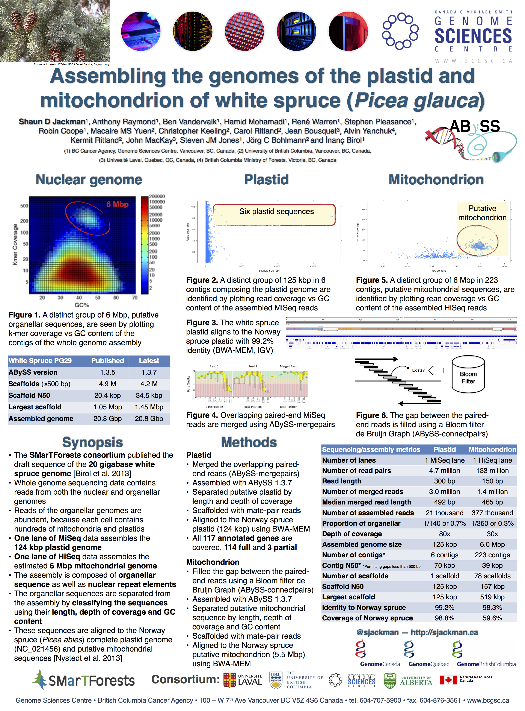
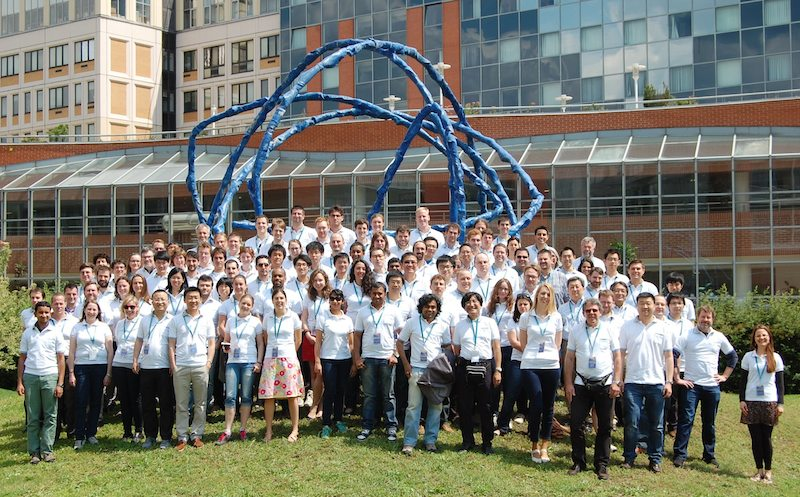
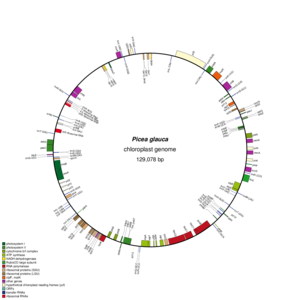

Thesis committee
================================================================================

Thesis committee
------------------------------------------------------------

| [Inanc Birol][]
| [Joerg Bohlmann][]
| [Steven Hallam][]

[Inanc Birol]: http://www.bcgsc.ca/faculty/inanc-birol
[Joerg Bohlmann]: http://bohlmannlab.msl.ubc.ca/
[Steven Hallam]: http://hallam.microbiology.ubc.ca/

Presentations and posters
================================================================================

Plant and Animal Genome XXII
------------------------------------------------------------

San Diego, California, USA

2014 January 10&ndash;15

International HPC Summer School 2014
------------------------------------------------------------

Budapest, Hungary

2014 June 1&ndash;6

2014 Conifer Genome Summit
------------------------------------------------------------

For&ecirc;t Montmorency, Qu&eacute;bec, Canada

2014 June 16&ndash;18

HiTSeq and ISMB 2014
------------------------------------------------------------

Boston, Massachusetts, USA

2014 July 11&ndash;15

Submitted manuscript
================================================================================

UniqTag
------------------------------------------------------------

| Content-derived unique and stable identifiers
| for gene annotation

Manuscripts in preparation
================================================================================

White Spruce Organelles
------------------------------------------------------------

Organellar Genomes of White Spruce (*Picea glauca*): Assembly and Annotation

>  

Distance Estimate
------------------------------------------------------------

Estimating the distance between two sequences using paired-end reads

> 

Manuscripts in planning
================================================================================

Homebrew Science
------------------------------------------------------------
