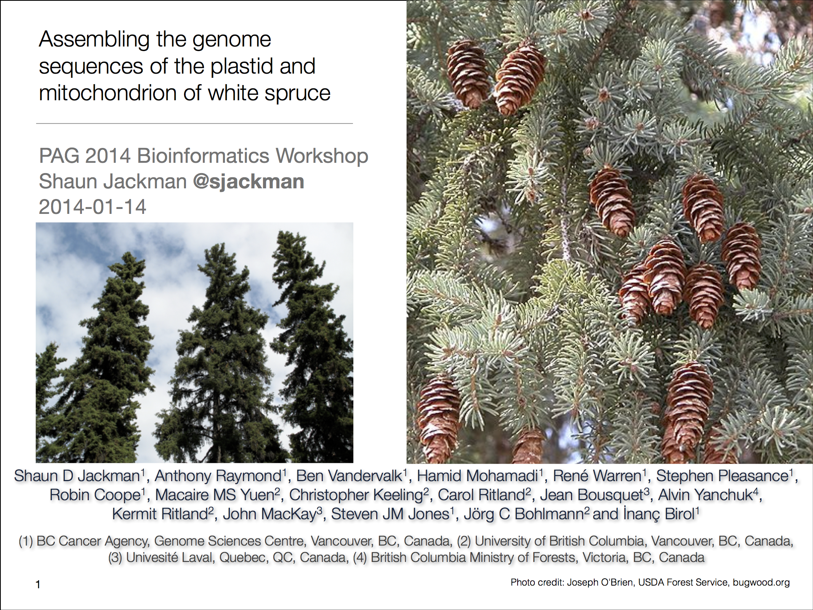
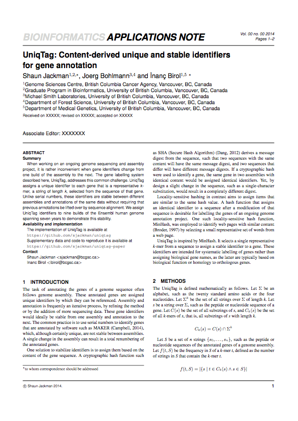
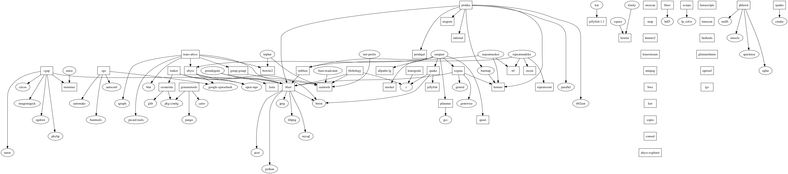

People
================================================================================

Shaun Jackman
------------------------------------------------------------

| [Genome Sciences Centre][], BC Cancer Agency
| Vancouver, Canada
| [\@sjackman][]
| [github.com/sjackman][]
| [sjackman.ca][]

[\@sjackman]: https://twitter.com/sjackman
[Genome Sciences Centre]: http://bcgsc.ca
[github.com/sjackman]: https://github.com/sjackman
[sjackman.ca]: http://sjackman.ca

Thesis committee
------------------------------------------------------------

| [Inanc Birol][]
| [Joerg Bohlmann][]
| [Steven Hallam][]

[Inanc Birol]: http://www.bcgsc.ca/faculty/inanc-birol
[Joerg Bohlmann]: http://bohlmannlab.msl.ubc.ca/
[Steven Hallam]: http://hallam.microbiology.ubc.ca/

Presentations and posters
================================================================================

Plant and Animal Genome XXII
------------------------------------------------------------

San Diego, California, USA

2014 January 10&ndash;15

[][PAG 2014 poster]

[PAG 2014 poster]: http://figshare.com/articles/Assembling_the_genomes_of_the_plastid_and_mitochondrion_of_white_spruce_Picea_glauca_/904941

PAG XXII
------------------------------------------------------------

### Bioinformatics workshop

San Diego, California, USA

2014 January 10&ndash;15

[][PAG 2014 workshop]

[PAG 2014 workshop]: https://speakerdeck.com/sjackman/assembling-the-genome-sequences-of-the-plastid-and-mitochondrion-of-white-spruce

HPC School
------------------------------------------------------------

### International HPC Summer School 2014

Budapest, Hungary

2014 June 1&ndash;6

[][International HPC Summer School 2014]

[International HPC Summer School 2014]: http://summerschool.niif.hu/

Conifer
------------------------------------------------------------

### Genome Summit 2014

For&ecirc;t Montmorency, Qu&eacute;bec, Canada

2014 June 16&ndash;18

[][Conifer Genome Summit 2014]

[Conifer Genome Summit 2014]: https://speakerdeck.com/sjackman/organellar-genomes-of-white-spruce-picea-glauca-assembly-and-annotation

HiTSeq and ISMB 2014
------------------------------------------------------------

Boston, Massachusetts, USA

2014 July 11&ndash;15

[][ISMB 2014 poster]

[ISMB 2014 poster]: http://f1000.com/posters/browse/summary/1096524

Teaching assistant
================================================================================

Teaching assistant
------------------------------------------------------------

[STAT 540][] Statistical Methods for High Dimensional Biology

[BIOF 520][] Problem-Based Learning In Bioinformatics

Designed and taught a module on genomic epidemiology.

[BIOF 520]: https://courses.students.ubc.ca/cs/main?dept=BIOF&course=520
[STAT 540]: http://www.ugrad.stat.ubc.ca/~stat540/

Submitted manuscript
================================================================================

UniqTag
------------------------------------------------------------

| Content-derived unique and stable identifiers
| for gene annotation

[][UniqTag]

[UniqTag]: http://dx.doi.org/10.1101/007583

Manuscripts in preparation
================================================================================

White Spruce Organelles
------------------------------------------------------------

Organellar Genomes of White Spruce (*Picea glauca*): Assembly and Annotation

[ ][White spruce organelles]

[White spruce organelles]: https://github.com/sjackman/white-spruce-organelle-paper

Distance Estimate
------------------------------------------------------------

Estimating the distance between two sequences using paired-end reads

[][DistanceEst]

[DistanceEst]: https://github.com/sjackman/distance-estimate-paper

Manuscripts in planning
================================================================================

Homebrew Science
------------------------------------------------------------

[Homebrew][] | [Linuxbrew][] | [Homebrew-science][]

[][open-science]:

Dependencies of bioinformatics tools in Homebrew

[Homebrew]: http://brew.sh
[Linuxbrew]: http://brew.sh/linuxbrew/
[Homebrew-science]: http://brew.sh/homebrew-science/
[open-science]: http://sjackman.github.io/open-science/#/homebrew-navigates-dependency-hell

fin
================================================================================

Links
------------------------------------------------------------

| [Inanc Birol][] | [Joerg Bohlmann][] | [Steven Hallam][]
| [PAG 2014 poster][] | [PAG 2014 workshop][]
| [Conifer Genome Summit 2014][] | [ISMB 2014 poster][]
| [International HPC Summer School 2014][]
| [BIOF 520][] | [STAT 540][]
| [UniqTag][] | [White spruce organelles][] | [DistanceEst][]
| [Homebrew][] | [Linuxbrew][] | [Homebrew-science][]
| [Open, reproducible science][open-science]

Shaun Jackman
------------------------------------------------------------

| [Genome Sciences Centre][], BC Cancer Agency
| Vancouver, Canada
| [\@sjackman][]
| [github.com/sjackman][]
| [sjackman.ca][]

